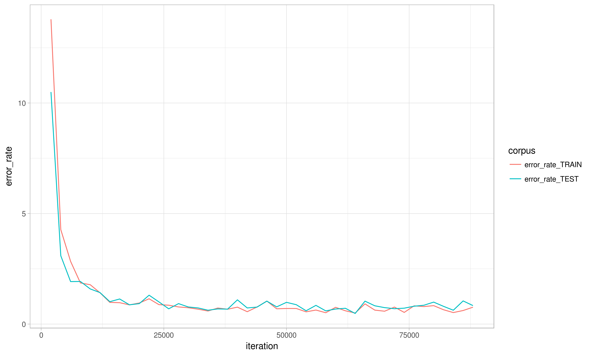

# OCRFraktur

<b>Goal:</b>
Training OCRopus software on Fraktur documents (early XX century, Austria)

<b><i>Training set:</b></i>
1.  4,287 lines from the magazine "(Tiroler) Soldaten-Zeitung" [published between 1915-1917]
    transcriptions derived from Amann, Klaus, Karl Corino, and Walter Fanta. 2009. Robert Musil, Klagenfurter Ausgabe. Kommentierte digitale Edition sämtlicher Werke, Briefe und nachgelassener Schriften. Klagenfurt: Robert Musil-Institut der Universität Klagenfurt. DVD edition [typos/modifications in the trascriptions were corrected] 
2.  3,000 artificially-generated lines, by using the ocropus-linegen function and three Fraktur fonts (BreitkopfFraktur, Kleist-Fraktur, and TypographerFraktur-Medium)
    text sources are: Robert Musil, articles published in Austrian journals between 1911 and 1919; Albert Ritter, Autonomie. Zur Frage der Neugestaltung Österreichs [Graz, 1917]

<b><i>Test set:</b></i>
1.  410 lines from the magazine "(Tiroler) Soldaten-Zeitung" [published between 1915-1917]
    transcriptions derived from Amann, Klaus, Karl Corino, and Walter Fanta. 2009. Robert Musil, Klagenfurter Ausgabe. Kommentierte digitale Edition sämtlicher Werke, Briefe und nachgelassener Schriften. Klagenfurt: Robert Musil-Institut der Universität Klagenfurt. DVD edition [typos/modifications in the trascriptions were corrected] 

<b>Results:</b>
Minimum character error rate for test set: 0.479% (at iteration #64,000; see model file: "TSZ_Fraktur_model.pyrnn.gz") 

Learning curve:

  

